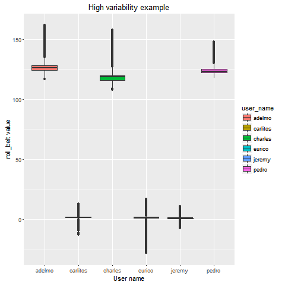
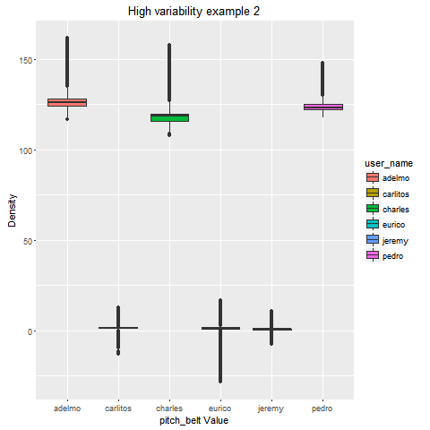

##Report for analysis of the Weight Lifting Exercises Dataset
<br>

####Data provided courtesy: 
<em>Velloso, E.; Bulling, A.; Gellersen, H.; Ugulino, W.; Fuks, H. Qualitative Activity Recognition of Weight Lifting Exercises. Proceedings of 4th International Conference in Cooperation with SIGCHI (Augmented Human '13) . Stuttgart, Germany: ACM SIGCHI, 2013.</em>

Read more: http://groupware.les.inf.puc-rio.br/har#weight_lifting_exercises#ixzz3vWGDyDo2

###Primary inspection

First inspection of the dataset revealed that in addition to the usual **'NA'** values, a large number of other redundant values were also present. There were a large amount of data points missing altogether (**empty strings**) and other cells were populated with the **'#DIV/0!'** value.
So the data was re-read into R using the following command. The ```read.csv()``` command had the parameter na.strings to take care of the unusual values.
```r
train <- read.csv("pml-training.csv", na.strings = c("NA", "#DIV/0!", ""))
```

There were certain columns which included an unreasonable amount of**'NA'**values. Moreover, the**'NA'**values were all limited to the rows for which variable new_window's value corresponds to yes. And none of the columns apart from these ones contain**'NA'**values.
Minor preprocessing was done to remove the columns featuring the **'NA'** values.
```r
na_vec <- lapply(train, function(x) any(is.na(x)))
sum(unlist(na_vec))
train <- train[!unlist(na_vec)]
```
Similar operation were performed on the test set.
```r
test <- read.csv(file = "pml-testing.csv", na.strings = c("NA", "#DIV/0!", ""))
test <- test[!unlist(na_vec)]
```

<br>

###Creating a cross-validation dataset

The provided training set was further split up into a training and a cross-validation set.
```r
split <- createDataPartition(train$classe, p = 0.7, list = F)
x_train <- train[split,]
x_test <- train[-split,]
```
The **x_train** dataset was used for further data exploration.

<br>

### Standardization of numerical data

There was a lot of variance in the numerical variables. 
The dataset featured high standard deviation (and variance) values.
```r
train_sd <- unlist((sapply(x_train, function(x) {if (is.numeric(x) | is.integer((x))) sd(x)})))
```
Some plots are provided below which help visualize the same.
```r
library(ggplot2)
qplot(user_name, roll_belt, data=x_train, fill=user_name, geom = c("boxplot"))
qplot(pitch_belt, data=x_train, colour=user_name, geom = c("density"))
```


<br> 



The ```pre_process()``` function from **caret** was used to standardize the numerical values in the x_train dataset.
```r
std_obj <- preProcess(x_train[,-c(1:6, 60)], method = c("center", "scale"))
x_train_std <- predict(std_obj, x_train[,-c(1:6, 60)])
```
Similar preprocessing was performed on the cross-validation and test dataset.

<br>

### Outlier removal

The ```summary()``` function and some plotting revealed that there was a row in the dataset still featuring outlier values. The row was removed.
```r
x_train <- x_train[!x_train$gyros_forearm_y > 10,]
```
<br>

### Choosing the algorithm

Since the output was a multi-class variable, simple logistic regression wouldn't have worked. I decided to take a pass on looking up multi-class logistic regression model as well for now.
Trying to fit a classification tree using ```rpart``` method didn't yield sufficiently high accuracy. 

#### Random Forest to the rescue!

A Random Forest model seemed like a good bet given the nature of output and the amount of predictors available.

```r
rf_mod <- randomForest(classe ~ ., data=x_train[,-c(1:6)], ntree = 20)
pred <- predict(rf_mod, x_test[,-c(1:6)])
confusionMatrix(pred, x_test$classe)
```

A random forest model using just 10 trees also provided extremely high accuracy (~99.5%) on the cross-validation dataset. But a 20 tree model was chosen to go for just a bit more accuracy.

The random forest model was able to correctly predict all the 20 required outcomes for the test set. 
```r
answers <- predict(rf_mod, test)
```

The high accuracy of the model might be attributed to the large amount of predictors data at hand. Also, random forest has been known to produce good results (high accuracy) for such a case.